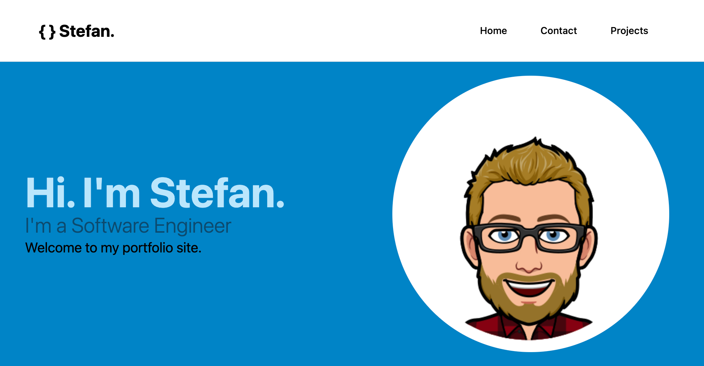

# React Portfolio

## Description

This is a portfolio website built with React. It is a single page application that uses React Router to navigate between pages. The portfolio page is populated with projects from a JSON file. The contact page uses a form to simulate sending an email to the site owner by logging the object to the console.

The production site is deployed to Vercel here: [React Portfolio](https://react-portfolio-five-psi.vercel.app/).

The site uses the following technologies:

- React
- React Router
- Tailwind CSS
- shadcn UI components (badge, button, card, sheet)

## Table of Contents

- [Description](#description)
- [Table of Contents](#table-of-contents)
- [Installation](#installation)
- [Tests](#tests)
- [Learning Outcomes](#learning-outcomes)
- [Resources Used](#resources-used)
- [License](#license)

## Installation

To install the project, clone the repository to your local development environment and run `npm install` to install the dependencies. Then run `npm run dev` to start the development server.

## Tests

To test the project, run `npm run test` to run the tests. The tests are written using Vitest, React Testing Library, Jest DOM and JS DOM. The tests are located in the `src/__tests__` folder.

These are only simple tests to demonstrate how to use React Testing Library and Vitest. The tests are not comprehensive and do not test all of the components.

## Learning Outcomes

- Learned how to use React Router to navigate between pages in a single page application.
- Learned how to use React Testing Library and Jest to test React components.
- Learned how to use the `useParams` hook to access URL parameters.

## Resources Used

- [Vitest with React Testing Library](https://www.robinwieruch.de/vitest-react-testing-library/)
- [Stack Overflow: Vitest with React Testing Library 'Unexpected Token'](https://stackoverflow.com/questions/74970340/vitest-with-react-testing-library-unexpected-token)
- [shadcn UI components](https://ui.shadcn.com/)

## License

Released under the MIT license. Full details in [LICENSE](./LICENSE).
